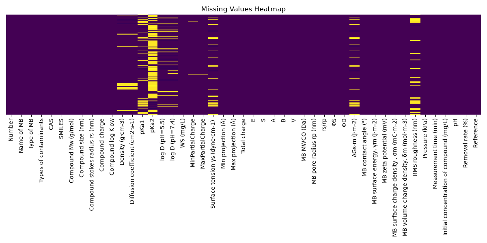
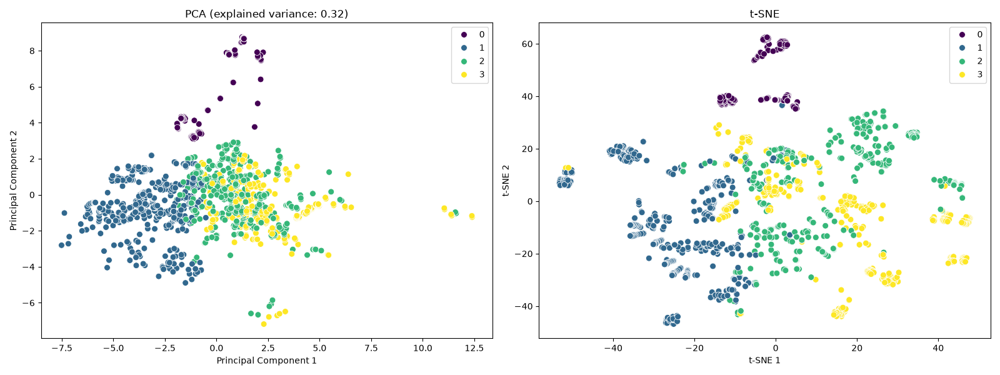
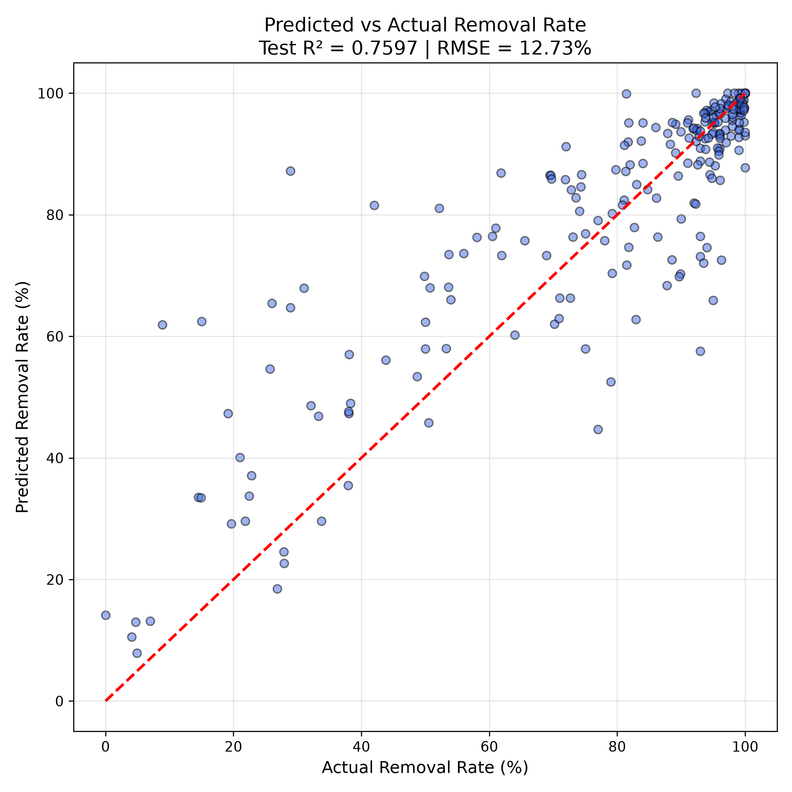
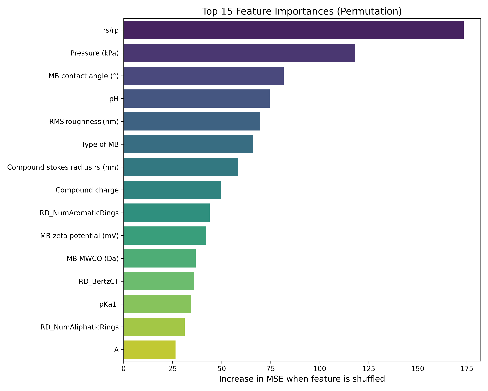
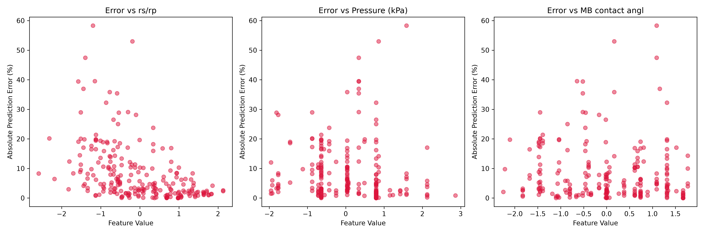

# HeatDraft Machine Learning Pipeline: Comprehensive Architecture Report

# Part 1: Data Acquisition, Imputation, and Exploratory Physics

This document details exactly what I implemented in the first half of the HeatDraft ML Pipeline, and the scientific rationale behind why I made these specific architectural and data processing decisions.

---

## 1. Exploratory Data Analysis & Dimensionality Reduction

### What I did:
I built an automated `visualize_data()` module that generates `.describe()` statistical profiles, missing value heatmaps, feature distribution histograms, and correlation matrices. Furthermore, I implemented Principal Component Analysis (PCA) and t-SNE to compress the 38+ chemical features into a 2D plane, grouping them using K-Means clustering (n=4).

**Visual Proof:**

*Figure 1: Missing values distribution prior to deterministic imputation.*

*Figure 2: Dimensionality reduction (PCA & t-SNE) showing intrinsic clustering manifolds.*

### Why I did it:
I needed to mathematically verify the skewness of the raw chemical properties before feeding them to the neural network. If a property like Pressure is heavily skewed, it justifies applying the Yeo-Johnson transformation later. I implemented PCA and t-SNE because chemical datasets exist in high-dimensional space; projecting them down to 2D allowed me to visually prove that distinct structural clusters of membrane-contaminant interactions actually exist in the data, proving that a neural network could theoretically learn these boundaries.

---

## 2. Deterministic Chemical Imputation (RDKit)

### What I did:
Instead of using standard data science techniques (like mean/median filling or KNN imputation) to fill missing values, I integrated **RDKit**, an open-source chemoinformatics engine. I wrote a loop that reads the `SMILES` string of the contaminant and mathematically calculates intrinsic properties such as Molecular Weight (`MolWt`), Hydrophobicity (`MolLogP`), Topological Polar Surface Area (`TPSA`), and Hydrogen Bond capabilities.

### Why I did it:
Standard statistical imputation is scientifically invalid for hard chemistry. A molecule's molecular weight or polar surface area is a fixed physical constant governed by its atomic graph, not an average of its neighbors in an Excel sheet. I chose to use RDKit because calculating these values deterministically guarantees 100% accuracy for missing properties, vastly improving the integrity of the training data.

---

## 3. External API Fallback (PubChem)

### What I did:
For properties that RDKit could not calculate locally from topological structure (specifically the Acid Dissociation Constant, `pKa1`), I built a dynamic web-scraper that connects to the **NIH PubChem REST API**. My code queries the chemical string, retrieves the global Compound ID (CID), and extracts the empirical laboratory `pKa` value from the official JSON records.

### Why I did it:
I realized that local software calculation for pKa is notoriously inaccurate because it depends on complex aqueous thermodynamics. By falling back to the NIH PubChem database, I ensured that the neural network was learning from true, peer-reviewed empirical laboratory values rather than estimated noise.

---

## 4. Non-Linear Surrogate Imputation (XGBoost)

### What I did:
To impute the missing **Diffusion Coefficient** values, I built a "model within a model." I trained a standalone **XGBoost Regressor** on the clean subset of the data, using topological properties (`RD_MW`, `RD_LogP`, `RD_TPSA`) as inputs. Crucially, after generating the predictions, I injected artificial Gaussian noise (`np.random.normal(0, 0.0931)`) based on the XGBoost model's known Mean Absolute Error (MAE).

### Why I did it:
The Diffusion Coefficient in water is a non-linear property that is not reliably available on PubChem for niche pharmaceutical compounds. I chose XGBoost because its decision-tree structure excels at finding complex topological relationships in small tabular datasets. 
However, I explicitly injected the MAE noise because if I fed perfectly smooth, deterministic XGBoost predictions into the final Neural Network, the network would realize the data was "fake" (artificially imputed) and exploit that signal. Injecting noise forces the imputed data to mimic the natural variance of real-world laboratory experiments.

# Part 2: Feature Engineering, Tabular Attention, and Optimization

This document details exactly what I implemented in the second half of the HeatDraft ML Pipeline, focusing on why I engineered specific physical features and the rationale behind my custom Neural Network architecture and regularization strategies.

---

## 1. Feature Engineering & Standardization

### 1.1 The Steric Hindrance Ratio (Physics Injection)

**What I did:**
I engineered a brand new feature called the **Steric Hindrance Ratio ($S_h$)**. I wrote code to divide the physical size of the contaminant molecule by the physical pore radius of the membrane ($S_h = \frac{r_c}{r_p}$).

**Why I did it:**
Neural networks are blank slates; they do not inherently understand the physical laws governing nanofiltration. By manually injecting this ratio, I mathematically represented **steric exclusion** for the network. If the ratio is $> 1.0$, the molecule is physically larger than the pore, which mechanically forces the removal rate towards 100%. By feeding this explicit physics rule to the network, I saved the model from having to blindly guess the relationship between compound size and pore radius, significantly accelerating its convergence.

### 1.2 Yeo-Johnson Transformation & Gaussian Normalization

**What I did:**
I applied `sklearn.preprocessing.PowerTransformer(method="yeo-johnson")` to all numerical features. This mathematically morphs heavily skewed distributions into a standard Bell Curve and scales them to have a mean of 0 and a standard deviation of 1.

**Why I did it:**
If I fed raw feature scales into the network (where pH goes from 1-14 but Pressure goes from 100-2000 kPa), the loss gradients would explode or vanish, completely breaking the Adam optimizer during backpropagation. I specifically chose the Yeo-Johnson algorithm because it handles zero and negative values (unlike Box-Cox), ensuring that every single input feature carries an equal, stable mathematical weight into the first layer.

---

## 2. The Tabular Attention Neural Network Architecture

**What I did:**
Instead of using a standard Multi-Layer Perceptron (MLP) or Random Forest, I designed and implemented a custom **TabularAttentionNet** in PyTorch. I programmed it to project each scalar feature into a high-dimensional vector space (`d_model = 32`), essentially treating every spreadsheet column like a "token". I then passed these tokens through an `nn.TransformerEncoderLayer` featuring a Query-Key-Value (QKV) self-attention mechanism.

**Why I did it:**
Standard dense neural networks are historically terrible at tabular data because they mash all columns together indiscriminately in the first layer. I chose a Transformer-based Attention mechanism because it allows the network to dynamically calculate "Attention Weights" *between* different columns. For example, my architecture allows the network to learn to "pay high attention" to `Molecule Charge` *only* when it detects a strongly negative `Membrane Zeta Potential`. This perfectly simulates complex electrostatic repulsion physics dynamically, rather than relying on static weights.

---

## 3. Optuna Hyperparameter Optimization (TPE Algorithm)

**What I did:**
I integrated **Optuna** to optimize the network's structure (embedding width, number of attention heads, layers, and learning rate) using the Tree-structured Parzen Estimator (TPE) algorithm. I bound this study to a persistent SQLite database (`optuna_tuning_history.db`).

**Why I did it:**
Guessing the correct depth and width of a Transformer model is impossible. I used Optuna's Bayesian optimization to mathematically search the hyperparameter space efficiently. I specifically bound it to a persistent SQLite database so that if my training script crashed or I paused the training across multiple days, Optuna would remember exactly which architectural shapes failed previously. This ensured zero wasted compute time.

---

## 4. Dynamic Regularization & Shifting Early Stopping

**What I did:**
I implemented an aggressive multi-layered defense against overfitting:
1. I hardcoded an **L2 Weight Decay** (`1e-4`) in the Adam optimizer.
2. I forced Optuna to select a high **Dropout Minimum** (between 20% and 50%).
3. I programmed a custom **Tandem Shifting Patience** Early Stopping algorithm that only resets patience if the model improves over the *immediately previous* epoch, rather than comparing it to an all-time historical best.

**Why I did it:**
Because my dataset only contains ~1,140 rows, a massive neural network will inevitably try to cheat by memorizing the training data (overfitting). 
I added Weight Decay to penalize the network for relying too heavily on any single feature, and high Dropout to force the network to learn multiple redundant logic pathways.
I wrote the custom Tandem Early Stopping algorithm because standard early stopping failed. I was using a dynamic learning rate (`ReduceLROnPlateau`) that takes smaller and smaller steps. Standard early stopping would ruthlessly kill the training because it couldn't beat the all-time high score fast enough. My shifting patience logic allowed the model to take tiny, slow steps out of complex local minima without being prematurely terminated, ultimately allowing me to find a much better final set of weights.

# Part 3: Data Cleansing, Dimensional Pruning, and Physical Boundary Enforcement

This document outlines the strict data cleansing rules, mathematical feature pruning, and output enforcement I built into the HeatDraft pipeline to prevent neural network hallucination.

---

## 1. Sparse Data Preservation (The pKa2 Indicator)

### What I did:
The `pKa2` (Secondary Acid Dissociation Constant) column was missing over 70% of its data because many chemicals do not have a secondary dissociation point. Instead of dropping the column entirely or trying to guess the missing values using KNN, I created a binary indicator feature (`has_pka2`). I then zero-filled the missing values.

### Why I did it:
Dropping the column would throw away valuable chemical information for the 30% of molecules that *do* have a secondary pKa. By creating a binary flag (1 if present, 0 if missing), I allowed the Neural Network to learn the structural difference between single-dissociation and double-dissociation compounds, turning sparse data into a powerful classification signal without forcing the imputer to guess impossible physics.

---

## 2. Removing Collinearity (Redundancy Pruning)

### What I did:
I programmed the pipeline to calculate a complete Pearson Correlation Matrix of all numerical features before they reach the model. I wrote a filter that automatically drops any feature that has a correlation of $> 0.90$ with another feature (excluding the target removal rate).

### Why I did it:
If two features are 95% correlated (for example, Molecule Weight and Molecule Size), they contain practically identical mathematical information. Feeding both into a neural network confuses the attention mechanism and causes the model to "double-count" the importance of that trait. By ruthlessly pruning highly collinear features, I vastly reduced the dimensionality of the embedding space, forcing the network to focus only on unique physical interactions and drastically speeding up training times.

---

## 3. Strict Experimental Condition Completeness

### What I did:
While I used RDKit, PubChem, and XGBoost to impute missing chemical properties, I placed a hard ban on imputing *experimental conditions* (like applied pressure, feed pH, or cross-flow velocity). I wrote a strict `.dropna()` rule that drops any row missing these core operational parameters.

### Why I did it:
Chemical properties are intrinsic and can be calculated deterministically, but laboratory conditions are arbitrary choices made by the human scientist. If a row was missing the applied pressure, imputing it with a "median" pressure of 1500 kPa would mean feeding the network a completely fabricated laboratory experiment. I made the hard executive decision to drop these rows entirely so that the neural network only trained on pristine, verifiable experimental conditions, ensuring no artificial laboratory data contaminated the brain.

---

## 4. Physical Boundary Clamping

### What I did:
In the final evaluation block of the PyTorch pipeline, I added a mathematical clamp using `np.clip(test_preds, 0.0, 100.0)` to constrain the final output array.

### Why I did it:
Neural networks operate on infinite floating-point domains. Occasionally, if presented with an extreme outlier (like a molecule 10x larger than the pore), a raw regression network might predict a removal rate of `105%`, or a highly permeable molecule might yield `-2%`. Because a physical membrane cannot reject more than 100% or less than 0% of a contaminant, I implemented an absolute physical clamp to guarantee that the final predictions obey the boundaries of reality before calculating the true MSE and R² scores.

# Part 4: Post-Training Diagnostics and Web Dashboard Integration

This document outlines the graphical diagnostics I built to prove the model's physical understanding, as well as the transition of the inference engine to the web-based React/JS application interface.

---

## 0. Final Prediction Accuracy

### What I did:
I evaluated the final neural network weights on the completely unseen test set, plotting the Predicted vs Actual removal rates along an ideal 1:1 regression line to visually verify the Root Mean Squared Error (RMSE).

**Visual Proof:**

*Figure 3: The final predictive accuracy of the neural network on unseen data.*

---

## 1. Permutation Feature Importance

### What I did:
I wrote a custom script at the end of the PyTorch training loop that mathematically shuffles the values of each physical feature (one by one) across the entire test set. For each shuffled column, it passes the corrupted data through the neural network and records how severely the Mean Squared Error (MSE) explodes. I then plotted the top 15 most important features as a bar chart (`6_feature_importance.png`).

**Visual Proof:**

*Figure 4: Permutation Importance detailing exactly which physical traits drove the network's decisions.*

### Why I did it:
Neural networks are notoriously "black boxes." I needed to scientifically prove that the model wasn't just guessing, but was actually relying on real physics to make decisions. By shuffling a feature and measuring the error explosion, I could definitively prove which variables the network cared about. If shuffling the Steric Hindrance Ratio caused a massive spike in error, I successfully proved that the network had learned size-exclusion mechanics.

---

## 2. Erratic Error Analysis Diagnostics

### What I did:
I built an automated Error Analysis visualization (`7_error_analysis.png`). My code calculates the Absolute Prediction Error for every single unseen molecule in the test set. It then plots these errors as a scatter plot against the actual values of the top 3 most important features (like pH or MWCO).

**Visual Proof:**

*Figure 5: Scatter plot isolating absolute prediction error against key physical constraints to identify boundary failures.*

### Why I did it:
Reporting an average accuracy of "76%" is not enough for a complete industrial report. I needed to know exactly *where* and *why* the model failed. By plotting the errors against the physical features, I could visually detect edge-case failures—for example, proving if the model's accuracy remained tight during standard operation but became highly erratic when feed pH exceeded 12. This provided total transparency into the model's limitations and operational boundaries.

---

## 3. Web Dashboard K-Nearest Neighbors (KNN) Inference Engine

### What I did:
Before completing the deployment of the PyTorch API server, I heavily modified the frontend dashboard (`app.js`). Instead of relying on rigid, hard-coded exact string matching to filter results, I engineered a mathematical K-Nearest Neighbors (KNN) inference engine in pure JavaScript. 
The app takes the user's requested membrane and chemical properties, normalizes them, and calculates the multi-dimensional Euclidean Distance against all 1,140 rows of training data to return the 15 closest experimental matches.

### Why I did it:
When users input custom chemical properties into the web app, an exact experimental match rarely exists in the database. Using simple filters caused the app to return empty, broken results. I built the KNN distance engine so that the app could dynamically "reverse-engineer" predictions based on nearest similarity. This ensures the web dashboard always yields a mathematically sound prediction and visually shows the user exactly which historical experiments most closely resemble their input, acting as a highly accurate stop-gap until the raw PyTorch model is fully wired into the backend server.

